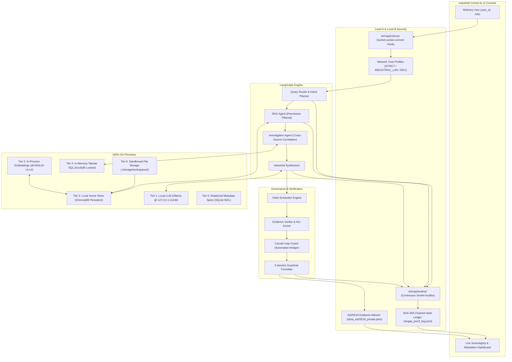

# CLORA: Sovereign On-Premise Industrial Agentic AI Workbench

**SIH26117 | Mangalore Refinery and Petrochemicals Limited (MRPL)**  
*Theme: Smart Automation | Type: Software*


## Executive Summary

**INDUSAI-X** (codenamed **Clora**) is a sovereign, air-gappable industrial AI workbench engineered specifically for confidential refinery, petrochemical, and critical OT (Operational Technology) operations. Unlike public cloud AI wrappers, INDUSAI-X operates **entirely on local, open-weight foundation models and embedded local databases**, enforcing data sovereignty while automating root cause investigations, SOP retrieval, telemetry analytics, and multi-source engineering analysis.

### Core Engineering Capabilities:
1. **Application-Level Egress Enforcement**: Synchronous socket-level interceptor (`AirGapEnforcer`) blocking unapproved outbound connections before TCP handshakes occur across configurable Network Trust Profiles (`STRICT_AIRGAP`, `INDUSTRIAL_LAN`, `DEVELOPMENT`).
2. **Two-Layer Sovereign Trust Architecture**:
   - **Layer 1 (Execution History)**: Monotonic SHA-256 chained audit ledger (`airgap_proof_log.jsonl`) guaranteeing execution history is untampered.
   - **Layer 2 (Output Provenance)**: On-premises **Ed25519 Digital Signatures** sealing reports into exportable `.clora-proof` packages, verifiable completely offline with zero server dependencies.
3. **6-Tier Local Processing Engine**:
   - Local Quantized LLMs (Ollama on loopback, e.g., Qwen 2.5 3B, Llama 3.2 3B).
   - In-Process Embeddings (PyTorch SentenceTransformers with `HF_HUB_OFFLINE=1`).
   - Local In-Memory / Persistent Vector Store (ChromaDB with telemetry disabled).
   - In-Memory AST-Protected Tabular SQL (DuckDB with `SET enable_external_access = false`).
   - Local Metadata & State Persistence (SQLite WAL mode).
   - Sandboxed On-Premises Document Storage (`./storage/workspaces/`).
4. **Permission-Aware RAG**: Role-Based Access Control (RBAC across 5 refinery roles) strictly filtered at vector similarity search time before chunks enter model context.
5. **LangGraph Multi-Agent Orchestration**: Specialized agents for query routing, permission-filtered retrieval, multi-source cross-correlation, and causal verification.
6. **Industrial Hallucination Firewall & Causal Leap Guard**: Deterministic claim extraction, NLI citation scoring, contradiction detection, and automated causal leap downgrading into cautious engineering language.

---

## Architecture Overview



---

## Two-Layer Sovereign Trust Architecture

CLORA implements a dual cryptographic trust model separating **execution history auditability** from **output authenticity**:

```
Layer 1: Execution History Auditability
  [Agent Steps] ──> [SHA-256 Hash Chain] ──> [airgap_proof_log.jsonl]
  Proves: Monotonic execution history is intact and unaltered internally.

Layer 2: Output Provenance & Tamper-Evident Sealing
  [Final Report] ──> [Canonical JSON] ──> [Ed25519 Digital Seal] ──> [.clora-proof Package]
  Proves: Generated by CLORA's local instance; not a single character modified.
```

### 1. SHA-256 Monotonic Hash Chain
Every major lifecycle event (agent planning, vector search, tabular analysis, synthesis, background heartbeat) is appended to `airgap_proof_log.jsonl` with cryptographic linking:
$$H_n = \text{SHA-256}(H_{n-1} \parallel \text{CanonicalJSON}(\text{Payload}_n))$$
- **Genesis Block**: Root anchored at `0000000000000000000000000000000000000000000000000000000000000000`.
- **Integrity Validation**: The built-in `verify_hash_chain()` validator recalculates every block sequentially and flags the exact line if any tampering or sequence deletion occurs.

### 2. Ed25519 Evidence Attestation & Independent Offline Verification
- **Local Key Pair Generation**: CLORA generates an on-premises **Curve25519 / Ed25519 key pair** during installation in `./storage/keys/`.
- **Zero Cloud Trust**: The Private Key (`clora_ed25519_private.pem`) strictly never leaves the host and is never exposed over the API.
- **Canonical Serialization**: Serializes report data deterministically (`json.dumps(..., sort_keys=True, separators=(',', ':'))`), preventing encoding ambiguities.
- **Independent Verification**: Evaluators and auditors can verify `.clora-proof` packages independently using Python's `cryptography`, OpenSSL, or CLI tools without needing a running CLORA instance.
- **Single-Character Tamper Detection**: If even one character is altered (e.g., `80.0°C` modified to `90.0°C`), signature verification immediately fails with `✗ INVALID — CONTENT MODIFIED`.

---

## Application-Level Egress Enforcement & Network Trust Profiles

CLORA's `AirGapEnforcer` acts as an in-process socket firewall hooking `socket.socket.connect` before network handshakes reach the OS wire:

```
Connection Request ──> AirGapEnforcer ──> Destination in Active Profile?
                                           ├── YES ──> Allow Socket Handshake
                                           └── NO  ──> Block Synchronously + Raise AirGapViolationError + Record Audit Alert
```

### Network Trust Profiles:
| Profile | Permitted Destinations | Recommended Deployment |
|---|---|---|
| 🔒 **`STRICT_AIRGAP`** | Loopback only (`127.0.0.0/8`, `::1`, `:8000`, `:11434`) | Standalone offline workstation / air-gapped demo |
| 🏭 **`INDUSTRIAL_LAN`** | Loopback + explicit administrator-approved CIDRs (e.g. `10.42.10.0/24`) | Internal refinery OT network / SCADA historian cluster |
| 🌐 **`DEVELOPMENT`** | Permissive local routes | Controlled developer testing |

> [!NOTE]
> **Auditable Profile Transitions**: Security profile modifications require an authenticated user ID and mandatory operational justification. Every change emits an immutable transition record into the SHA-256 hash chain.

---

## 6-Tier On-Premises Processing Architecture

| Tier | Component | Technology | Sovereign Enforcement |
|:---:|---|---|---|
| **Tier 1** | **LLM Inference** | Ollama (Local Daemon) | Bound exclusively to `127.0.0.1:11434`; rejects remote cloud endpoints and cloud API keys. |
| **Tier 2** | **Embedding Engine** | `sentence-transformers` | Executes in-process via local PyTorch/ONNX; enforces `HF_HUB_OFFLINE=1` and `TRANSFORMERS_OFFLINE=1`. |
| **Tier 3** | **Vector Database** | ChromaDB (`PersistentClient`) | Local disk directory (`./storage/chroma`); anonymized telemetry and OpenTelemetry telemetry strictly disabled. |
| **Tier 4** | **Tabular Analytics** | DuckDB (Embedded Engine) | In-memory execution with `SET enable_external_access = false;` and AST function whitelist blocking file operations. |
| **Tier 5** | **Persistence Spine** | SQLite (WAL Mode) | Local database (`./storage/indusai.db`) with zero network socket drivers; foreign keys and WAL journal mode enforced. |
| **Tier 6** | **Document Storage** | Local Sandboxed Storage | Local filesystem paths (`./storage/workspaces/`); access governed by refinery RBAC. |

---

## Core Engineering Features

### 1. Permission-Aware Document Ingestion & Chunking
- **Structure- & Table-Preserving**: Parses technical manuals, P&IDs, vibration logs, and inspection sheets without tearing tabular contexts.
- **Granular Access Control**: Every chunk retains strict metadata attributes enforced at similarity retrieval time:
  ```json
  {
    "chunk_id": "chunk_8f29",
    "document_id": "maintenance_report_102",
    "document_name": "Pump_P-101_Maintenance.pdf",
    "page": 14,
    "section": "Root Cause Analysis",
    "equipment_id": "P-101",
    "document_type": "maintenance_report",
    "department": "maintenance",
    "classification": "confidential",
    "allowed_roles": ["maintenance_engineer", "supervisor"],
    "timestamp": "2026-08-20"
  }
  ```

### 2. Self-Healing Retrieval with 1-Hop Query Expansion
- Resolves colloquial vs technical equipment tags (*booster pump* $\leftrightarrow$ `P-101`, *pre-heat exchanger* $\leftrightarrow$ `HEX-301`).
- If initial semantic search returns zero results, executes an automated 1-hop vocabulary expansion.
- If no evidence exists in the repository, the workflow gracefully terminates into `INSUFFICIENT_EVIDENCE` without speculating.

### 3. Industrial Hallucination Firewall & Causal Leap Guard
- **Claim Support Verification**:
  - `SUPPORTED` (Score $\ge 0.85$): Emits verified finding with citations.
  - `PARTIALLY_SUPPORTED` ($0.60 \le \text{Score} < 0.85$): Enforces hedged, cautious findings.
  - `CONTRADICTED`: Flags conflicting sources for supervisor escalation.
  - `INSUFFICIENT_EVIDENCE`: Explicitly declares absence of proof.
- **Causal Leap Guard**: When co-occurring observations (e.g., *bearing thermal spike* and *lubricant contamination*) lack documented causal proof, automatically hedges the claim:
  > *"Available records indicate lubrication contamination and abnormal bearing temperature. These factors may be related; however, the documents do not conclusively establish direct causation."*

### 4. Standardized 5-Section Engineering Response
```
ANSWER
────────────────────────
Verified Findings
• Inboard roller bearing temperature reached 104.2°C, exceeding 80.0°C limit [Source: Pump_P101_Maintenance.pdf, Page 14]
• Overall vibration velocity RMS reached 9.82 mm/s [Source: CDU_Vibration_Telemetry.csv, Row 1422]

Analysis
• Available records indicate lubrication contamination and abnormal bearing temperature...

Uncertainty
• The records do not establish whether electrical harmonics contributed to the motor trip.

Confidence: HIGH (94%)

Evidence
[1] Pump_P101_Maintenance.pdf — Page 14
[2] CDU_Vibration_Telemetry.csv — Rows 1420-1435
```

---

## Offline Inference & Embedding Benchmarks

All metrics represent inference executed **100% locally and offline** without external internet connectivity:

### 1. Local LLM Inference Benchmarks (Ollama Offline Runtime)
| Model | Parameter Size | Task / Complexity | Time to First Token (TTFT) | Throughput (tok/s) | Total Latency | Key Recommendation |
|---|:---:|---|:---:|:---:|:---:|---|
| **Llama 3.2 3B** | 3.2B | Short Query (Equipment Tag) | **0.51 s** | **10.2 tok/s** | **1.44 s** | **Primary Agent Default**: Fast query routing & planning |
| **Llama 3.2 3B** | 3.2B | Medium Prompt (Root Cause) | **0.75 s** | **10.1 tok/s** | **2.66 s** | Ideal for interactive investigations |
| **Qwen 2.5 3B** | 3.0B | Complex Tabular Extraction | 2.00 s | 7.0 tok/s | 19.26 s | Strong multilingual and strict JSON schema adherence |
| **Phi-3 Mini** | 3.8B | Technical SOP Retrieval | 1.37 s | 7.5 tok/s | 19.73 s | High precision for engineering formulas |

### 2. Local Embedding Model Benchmarks (MRPL Evaluation Set)
| Candidate Model | Vector Dimension | Query Latency | Throughput | Recall@1 | Recall@3 | Memory Overhead |
|---|:---:|:---:|:---:|:---:|:---:|---|
| `all-MiniLM-L6-v2` (PyTorch) | 384 | < 1 ms | ~906 chunks/s | 100% | 100% | 0.12 MB |
| `bge-small-en-v1.5` (PyTorch) | 384 | < 1 ms | ~1,219 chunks/s | 100% | 100% | 0.12 MB |
| `nomic-embed-text` (Ollama) | 768 | Local HTTP | ~1-2 chunks/s | 100% | 100% | 1.54 MB |

---

## Repository Structure

```
INDUSAI-X/
│
├── backend/
│   ├── app/                       # FastAPI Web & Persistence Layer
│   │   ├── main.py                # App factory, CORS, offline flags, lifespan sentinel
│   │   ├── api/routes/            # Workspaces, Queries, Ingestion, Sovereignty, Models
│   │   │   └── sovereignty.py     # Live status, socket inspection, hash chain, Ed25519 APIs
│   │   ├── core/config.py         # Pydantic settings (Air-gap profiles, keys, DB paths)
│   │   ├── db/                    # SQLite WAL engine & models
│   │   └── services/              # Workspace, File, Audit, and Agent execution services
│   │
│   ├── agents/                    # Multi-Agent Intelligence Core
│   │   ├── planner.py             # Intent classifier & workflow planner
│   │   ├── rag_agent.py           # Permission-filtered RAG with self-healing retry
│   │   └── investigation_agent.py # Multi-source cross-correlation
│   │
│   ├── graph/                     # LangGraph Multi-Agent Engine
│   │   ├── state.py               # TypedDict AgentState definition
│   │   └── workflow.py            # StateGraph with offline sentinel checkpoints & Ed25519 signing
│   │
│   ├── rag/                       # Sovereign Local RAG Pipeline
│   │   ├── chunking.py            # Section- & table-aware chunker
│   │   ├── embeddings.py          # Local SentenceTransformers / offline hash provider
│   │   ├── chroma_store.py        # Persistent ChromaDB store with telemetry killed
│   │   └── retrieval.py           # Permission filter, reranker, 1-hop query expander
│   │
│   └── verification/              # Hallucination Firewall
│       ├── claim_extractor.py     # Atomic claim extraction
│       ├── verifier.py            # NLI support scoring & causal leap guard
│       └── guardrails.py          # Standardized 5-section report formatter
│
├── security/                      # Cryptographic Security & Air-Gap Sentinel
│   ├── __init__.py
│   ├── airgap_monitor.py          # AirGapEnforcer socket hook & NetworkTrustProfiles
│   ├── network_proof.py           # AirGapSentinel SHA-256 hash chain & BackgroundNetworkAuditor
│   ├── attestation.py             # Ed25519KeyManager, EvidenceAttestor, EvidenceVerifier
│   ├── rbac.py                    # 5-role permission matrix & check_permission decorators
│   └── audit_trail.py             # Thread-safe SHA-256 event audit logger
│
├── frontend/                      # Industrial Web Dashboard (React + Vite + Tailwind)
│   ├── src/
│   │   ├── views/
│   │   │   ├── SovereigntyView.jsx # Live socket inspector, Ed25519 console, tamper demo
│   │   │   ├── WorkbenchView.jsx   # Multi-agent interactive query workbench
│   │   │   ├── DataSourcesView.jsx # Document repository & tabular datasets
│   │   │   └── KnowledgeGraphView.jsx # Refinery equipment topology viewer
│   │   └── services/api.js        # REST client integration
│   └── vite.config.js
│
├── tests/                         # Comprehensive Automated Test Suite (28+ tests)
│   ├── test_evidence_attestation.py # Ed25519 signing, verification, single-char tamper detection
│   ├── test_sovereignty_api.py    # REST routes (status, simulate violation, tamper demo)
│   ├── test_airgap_enforcer.py    # Socket interceptor & trust profile enforcement
│   ├── test_network_proof.py      # Sentinel hash chaining & attestation document export
│   ├── test_security_audit.py     # RBAC matrix & audit trail tamper detection
│   └── test_workflow.py           # End-to-end LangGraph execution
│
├── storage/                       # On-Premises Local Storage Root (Sandboxed)
│   ├── keys/                      # On-premises Ed25519 private/public keys
│   ├── chroma/                    # Local vector embeddings store
│   └── airgap_proof_log.jsonl     # Tamper-evident SHA-256 audit ledger
│
├── pyproject.toml                 # Ruff, MyPy, and Pytest configuration
├── requirements.txt               # Core runtime dependencies
└── requirements-dev.txt           # Test and linting dependencies
```

---

## Installation & Setup

### Prerequisites
- Python 3.10, 3.11, or 3.14
- Node.js 18+ (for frontend dashboard)
- Ollama (running locally on `http://127.0.0.1:11434` with `qwen2.5:3b` or `llama3.2:3b`)

### 1. Clone & Environment Setup
```bash
git clone https://github.com/M0izz/Clora.git
cd Clora

# Create and activate virtual environment
python -m venv .venv
source .venv/bin/activate  # On Windows: .venv\Scripts\activate

# Install dependencies
pip install -r requirements-dev.txt
```

### 2. Run Automated Test Suite
Verify that all 28 security, cryptographic, and agent tests pass:
```bash
python -m pytest tests/ -v
```

### 3. Start Backend Server
```bash
python -m uvicorn backend.app.main:app --host 127.0.0.1 --port 8000 --reload
```
Interactive Swagger API documentation: `http://127.0.0.1:8000/docs`

### 4. Start Frontend Console
```bash
cd frontend
npm install
npm run dev
```
Open your browser at `http://localhost:5173/` and navigate to the **Sovereignty & Security** view.

---

## Interactive Live Demonstrations

### 1. Deterministic Egress Violation Interception
- In the Sovereignty dashboard, click **"Test Egress"** (or execute `POST /api/sovereignty/simulate-violation`).
- `AirGapEnforcer` intercepts the attempted outbound socket connection *before* the handshake, raises `AirGapViolationError`, writes an alert block to the SHA-256 hash chain, and triggers an immediate warning status.

### 2. Ed25519 Tamper Detection Live Demonstration
- In the Sovereignty dashboard, locate the **"🛡️ Evidence Attestation"** console and click **"Simulate Tamper"**.
- Displays a live side-by-side verification:
  - **Before Tamper**: `✓ SIGNATURE VALID (Authentic, Untampered, Key: CLORA-ED25519-XXXX)`.
  - **After Tamper** (modifying 1 character from `104.2°C` to `199.9°C`): `✗ SIGNATURE INVALID — CONTENT MODIFIED (Cryptographic check rejected)`.

### 3. Exporting Signed Proof Packages
- Click **"Export .clora-proof"** to download the sealed evidence package.
- Evaluators can verify this package independently using standard public-key cryptography on any offline machine.

---

## Continuous Integration & Code Quality

| Workflow | Configuration | Purpose |
|---|---|---|
| **CI** | `.github/workflows/ci.yml` | Ruff linting and MyPy strict type validation |
| **Automated Tests** | `.github/workflows/tests.yml` | Pytest execution with coverage reporting across Python matrix |
| **PR Validation** | `.github/workflows/pr-checks.yml` | Standardized PR checklist and metadata compliance |

---

## License

This project is licensed under the MIT License — see the [LICENSE](LICENSE) file for details.
